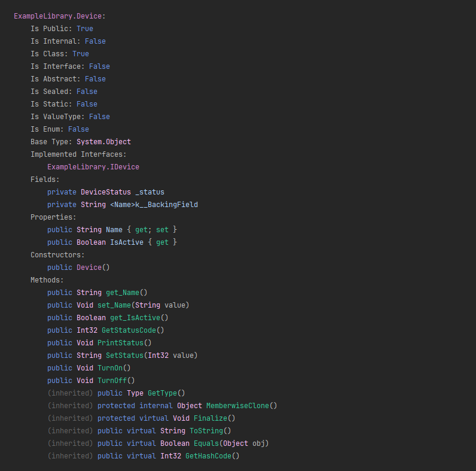
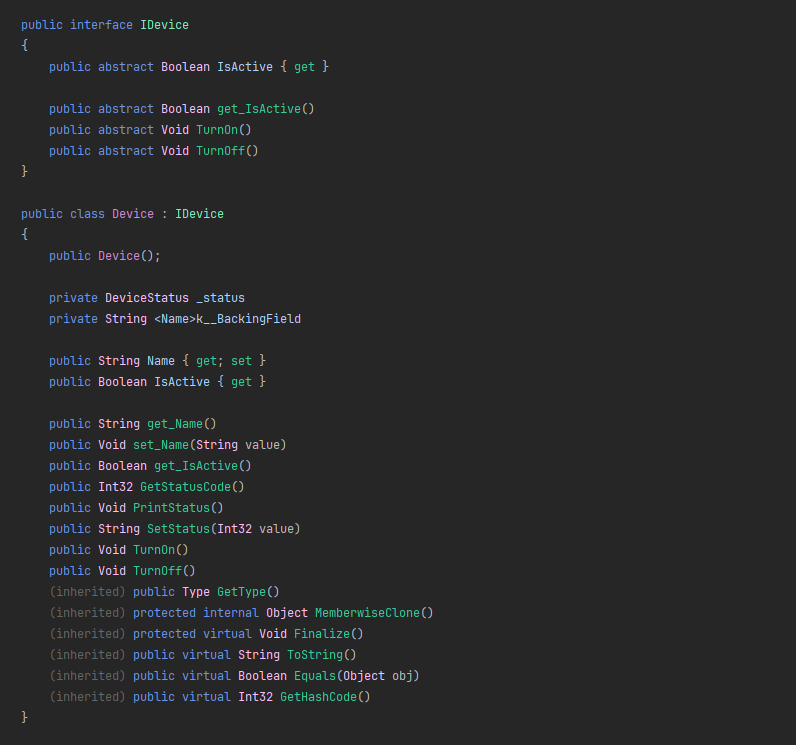
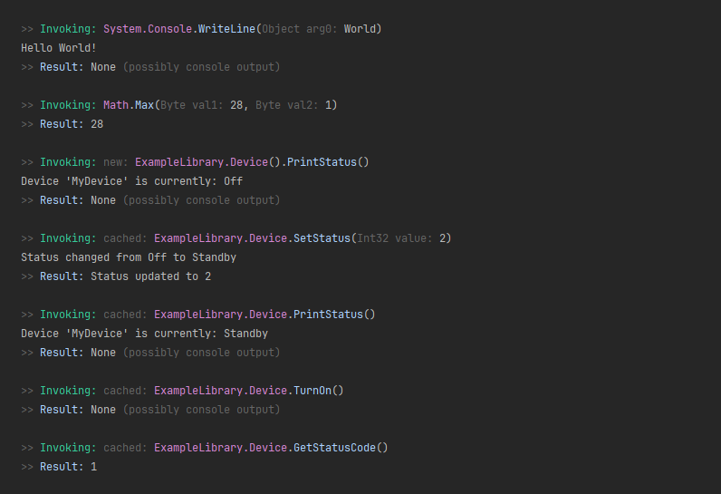

# .NET Component Inspector
A command-line tool for inspecting .NET assemblies using reflection. Provides detailed analysis of
types, members, and assembly structure with support for dynamic method invocation.

## Features
- **Assembly Analysis** — Load and inspect any .NET DLL file
- **Type Discovery** — List all types with modifiers, inheritance, and implemented interfaces
- **Member Inspection** — View fields, properties, methods, and constructors with full signatures
- **Code Structure Visualization** — Display complete assembly structure in C# syntax format
- **Dynamic Method Invocation** — Execute static and instance methods with automatic type conversion
- **Rich Console Output** — Colour-coded terminal output for improved readability
----------------------------------------------------------------------------------------------------
<br>

## Requirements
`.NET 9.0 Runtime`

<br>

## Usage

```bash
ComponentInspector.exe <assembly-path> [options]
```

### Basic Examples
```bash
# Display help
ComponentInspector.exe --help

# List all types in assembly
ComponentInspector.exe example.dll --types

# Show all methods
ComponentInspector.exe example.dll --methods

# Display complete assembly structure
ComponentInspector.exe example.dll --all

# Invoke a static method
ComponentInspector.exe example.dll --invoke System.Math.Max 10 20

# Invoke an instance method
ComponentInspector.exe example.dll --invoke ExampleLibrary.Device.SetStatus 1
```
----------------------------------------------------------------------------------------------------
<br>

## Command Reference
| Option | Long Form       | Description                                       |
|:------:|:----------------|:--------------------------------------------------|
| `-h`   | `--help`        | Display help information                          |
| `-v`   | `--verbose`     | Enable verbose output with additional information |
| `-t`   | `--types`       | List all types in the assembly                    |
| `-f`   | `--fields`      | List all fields grouped by type                   |
| `-p`   | `--properties`  | List all properties grouped by type               |
| `-m`   | `--methods`     | List all methods in the assembly                  |
| `-a`   | `--all`         | Display complete type structure with all members  |
| `-i`   | `--invoke`      | Invoke a method with specified arguments          |

<br>

## Output Examples

### Type Listing (`--types`)


### Complete Structure (`--all`)


### Method Invocation (`--invoke`)


----------------------------------------------------------------------------------------------------
<br>

## Method Invocation

The tool supports invoking both static and instance methods:

### Static Methods — *(must load assembly)*
```bash
ComponentInspector.exe MyLibrary.dll --invoke System.Math.Sqrt 16
```

### Instance Methods
For instance methods, the tool automatically creates an instance using the parameterless constructor:
```bash
ComponentInspector.exe MyLibrary.dll --invoke MyNamespace.MyClass.MyMethod "input string"
```

### Type Conversion
Arguments are automatically converted to match method parameter types:
- Numeric types (`int`, `double`, `decimal`, etc.)
- Strings
- Booleans
- Enums (by name or value)

<br>

## Architecture
The application partially follows a modular design with separation of concerns:

| Component                                                          | Description                                                                                                                                       |
|:-------------------------------------------------------------------|:--------------------------------------------------------------------------------------------------------------------------------------------------|
| **Core Interfaces**                                                | Define contracts for component inspection, logging, and argument parsing                                                                          |
| **Command-line Argument Parser**                                   | Converts and presents passed arguments into program-readable configuration                                                                        |
| **Reflection Assembly Inspector** <br/> *(God class anti-pattern)* | Handles assembly loading and type analysis using .NET Reflection API, manages dynamic method invocation with type conversion and instance caching |
| **Console Presentation**                                           | Formats and displays inspection results with syntax highlighting                                                                                  |

<br>

## Building from Source

```bash
dotnet build
```

Run with the example library:
```bash
dotnet run -- example.dll --all
```
----------------------------------------------------------------------------------------------------
<br>

## Use Cases
- **Library Exploration** — Quickly understand third-party library structure without documentation
- **API Discovery** — Find available methods and their signatures in compiled assemblies
- **Testing** — Invoke methods directly from command line for quick testing
- **Learning** — Understand .NET assembly structure and reflection capabilities
- **Debugging** — Inspect types and members when source code is unavailable